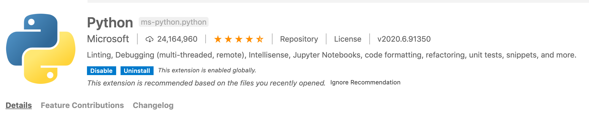

# Week 2: Python setup and our first "Python" forecast<!-- omit in toc -->
____
### Table of Contents<!-- omit in toc -->
- [To Do List](#to-do-list)
- [Setup Instructions](#setup-instructions)
    - [1. Install Miniconda](#1-install-miniconda)
    - [2. Make an environment for this class and activate it](#2-make-an-environment-for-this-class-and-activate-it)
    - [3. Install our first python packages](#3-install-our-first-python-packages)
    - [4. Install VS code](#4-install-vs-code)
    - [5. Setup VS Code:](#5-setup-vs-code)
- [Required Training Activities](#required-training-activities)
- [Optional -- but highly recommended -- training activities](#optional----but-highly-recommended----training-activities)
- [Assignment 2: First Python Forecast](#assignment-2-first-python-forecast)
    - [1. Download the stream gauge observations to your homework repo](#1-download-the-stream-gauge-observations-to-your-homework-repo)
  - [2. Copy the starter code for this week into your homework repos](#2-copy-the-starter-code-for-this-week-into-your-homework-repos)
  - [3. Use the python script to explore the data](#3-use-the-python-script-to-explore-the-data)
  - [4. Submit your forecast to the competition](#4-submit-your-forecast-to-the-competition)
  - [5. Submit your forecast homework assignment](#5-submit-your-forecast-homework-assignment)

___
<a name="todo"></a>
## To Do List
1. Follow all of the [ Setup Instructions](#setup) to install miniconda, and VS Code and to setup your python environment **before class on Thursday**
3. Complete the required training Activities **get through as much as you can before class Thursday**
4. Submit your second streamflow forecast and assignment by **noon on Monday** following the instructions in the [ Forecast Assignment](#assignment).

___
## Setup Instructions

#### 1. Install Miniconda
- Download and install the correct version of mini conda for your operating system. You can find all the options [here](https://docs.conda.io/en/latest/miniconda.html). Make sure you **pick the Python3.x not Python2.x version** for your system. Follow the prompts to install. The default options should be fine.
- Once you have done this you should be able to check you have it installed by typing `conda info` from command line. If it worked you should see all the info for what you just installed.
- If you get a message saying "command not found" when you type `conda info` then you will need to do the following additional steps:
  - open a new git bash window and type `vi .bash_profile`
  - You have now opened a file called ".bash_profile" in the program *vi*. To start editing this file type `i` you will see at the bottom of the screen that it is in insert mode now'
  - now type the following line into your file replacing the 'username' with whatever your user name is on your computer:
  ```
  export PATH="/c/Users/username/miniconda3/Scripts:$PATH"
  ```
  - Once you have typed this line hit the **escape** button to exit insert mode
  - Now hold down the **shift** key and type `zz` to exit and save your changes
  - To be sure you did it right you can `vi .bash_profile` again and you should see the line you added there. To quit without saving type `:q!`
  - Now that we have updated our bash profile we need to source it. So from you terminal type: `source .bash_profile`
  - If this worked you should no longer get a "command not found error" when you type `conda info`
  - Assuming you passed the last test you need to do one more setup step by typing `conda init bash`
  - Finally, to get this last step to take effect you will need to **close your current git bash window and open an new one**.
  - Fingers crossed... this should do it. You can now proceed to step 2!

#### 2. Make an environment for this class and activate it
 *You can follow along with* this **[video](https://arizona.hosted.panopto.com/Panopto/Pages/Viewer.aspx?id=250d67dd-2cc5-4b7c-a7db-ad920101b7c2&start=1)** *to see me walk through the steps.*
 - Next we will create a python environment for this class. You can follow along directly with the commands I have outlined below. All commands should be run from command line (i.e. terminal for mac or GitBash for windows). For more details  you should also refer to this [Quick environment setup workflow](https://uoa-eresearch.github.io/eresearch-cookbook/recipe/2014/11/20/conda/) or this [moredetailed user-guide for managing environments](https://docs.conda.io/projects/conda/en/latest/user-guide/tasks/manage-environments.html).
```
conda create --name hastools python=3.8
```
 If this was successful you should see 'hastools' in your list of environments if you type
  ```
  conda env list
  ```
  Next you will want to activate your environment by typing
  ```
  conda activate hastools
  ```
  You should now see the environment name 'hastools' at the start of your command line prompt and if you type `conda env list` again you will see that this is the active environment.

  Finally we will configure our environment so that it defaults to installing packages using conda forge. Make sure you have activated the hastools environment by typing `conda activate hastools` before you run these lines

  ```
  conda config --add channels conda-forge
  conda config --set channel_priority strict

  ```

#### 3. Install our first python packages
For assignment 2 you will need the python packages **pandas** and **matplotlib**. You can install them from command line like this:
  ```
  conda install pandas

  ```
  It will likely get a list of packages in addition to Pandas which are depedancies it needs to install. If it asks you if you  want proceed type `y` for yes. After you have installed a package you can check if its installed by listing the packages in your active environment like this:
  ```
  conda list

  ```
  Repeat this step replacing for matplot lib by typing `conda install matplotlib`. Remember these steps as you will need to repeat them throughout the semester as we use more  packages.

#### 4. Install VS code
The IDE we will be using this semester is Visual Studio Code, called VS Code for short. Let's get it downloaded.
- **Mac users:**
  - Use this [link](https://code.visualstudio.com/) or just google 'vs code'. Click on *Download for Mac Stable Build*
  - Go to your Downloads folder and click on *VSCode-darwin-stable.zip*. Click and drag the Visual Studio code.app application into your Applications folder.
  - Open the application and make sure you can see the 'Welcome' and 'Untitled' tabs.
    - *Note:*A dialogue box might pop up stating that it’s an application downloaded from the internet, asking if you want to open it. Click Open.

- **Windows users:**
  - Use this [link](https://code.visualstudio.com/) or google vs code. Click on *Download for Windows Stable Build*.
  - Open the download and click the 'I accept the agreement' button.Click 'Next' and then 'Next' (let your machine choose where to put it).
  - When the *Select Addtional Tasks* window pops up, check all of the boxes before hitting 'Next.'
  - Now, you should be able to hit 'Install' and 'Finish.'
  - Open the application.

#### 5. Setup VS Code:
 *You can follow along with* this **[video](https://arizona.hosted.panopto.com/Panopto/Pages/Viewer.aspx?id=5f51c781-dc73-46b8-ac43-ad92011c95eb&start=2)** *to see me walk through the steps.*
See this video for a walkthrough of VSCode setup.
  1. Install extensions: There is a large marketplace of VSCode extensions and a million ways you can customize your environment. For now though we will just start with two extensions. To install and extension go to `view > extensions` on the dropdown menu or choose extensions from your panel on the left. Once there you can search for the extensions you want to install.
    - First search for 'python'. You want the main one that comes up. It looks like this:
    
    Click `install` to install
    - Next search for `Markdown All In One` and install it.  

  2. Use `File Open` to open your directory for this class that has all of your repos.  You should see a file list on the left where you can easily explore all of your files now. If it asks you if you trust the authors, say yes.

  3. Next we will set our python environment
    - Type `Command + Shift + P` (apple) or `Ctrl + Shift + P`(windows) to pull up the command pallet
    - Type `Python: Select Interpreter` into the command pallet dialog (NOTE: once you start typing it should give you a list to choose from so you don't have to type the whole thing)
    - Choose the `hastools` conda environment you created earlier
    - If this is  done correctly you should see your python environment in the bottom left corner of your vs code window like this:
    

  4. At this point you should  try running a python script.
    - From your folder list double click to open `week2_hello_world.py`
    - Click on the `run_cell` button at the top of the script to run it
    
    - Note: when you try to run a script using Python Interactive in VSCode for the first time, you will be prompted in a dialog box to download IPyKernal say yes to this.
    - If the code runs correctly you should have an interactive window that opens up and looks something like this:
    

    - If you are unable to download IPyKernal see instructions below

  5. If you want to be able to automatically run lines without copying and pasting every time (which is very helpful!). Do the following:
    - In VSCode go to: File  >  Preferences  >  Settings
    - At the top, type in the Search settings bar: 'send selection'
    - Check the check box called 'Python > Data Science: Send Selection To Interactive Window'
    - To test if it works just highlight the `Print('hello_world')` from the editor and hit `shift+enter` and it will should automatically in your interactive window.

   4.b Fix for issue installing IpyKernal (skip if step 4 worked for you)
    - If the terminal reports an error similar to the below (in addition to a bunch of other text) when you try to run:
      ```
      conda : The term 'conda' is not recognized as the name of a cmdlet, function, script file, .....
      ```
     - The problem is that the default terminal in VSCode (for windows) is power shell. Power shell doesn't work well with VSCode.
     - The solution is to change the default terminal in VSCode to 'command prompt' using the following steps:
      1. Hit ctrl+shift+p
      2. Search for 'Terminal: Select Default Shell', and click
      3. There should be a few available, including 'bash', 'power shell', and 'command prompt'. Click on 'command prompt'
      4. Exit and re-enter VSCode for the change to stick.

     - That's it! You should be able to download IPyKernal and run your script now.
     - To further check that 'command prompt' is your default terminal:
      5. Click in the toolbar View > Terminal
      6. At the top of the terminal, you should see a drop-down menu. Listed at the very top should be '1: cmd'.
      7. You can triple check by seeing `conda` and `python` work in the command line. For example, simply type in `conda`, and you'll get back a message starting with `conda is a tool for managing and deploying applications, environments and packages.`.
     - If something went wrong, you'll find a message such as: `bash: conda: command not found`. Try to start at step 1 again.

___
## Required Training Activities
- Work through the following sections of Intro to Earth Data Science covering python fundamentals and Python Environments.
  - Read [Chapter 4 Lesson 1](https://www.earthdatascience.org/courses/intro-to-earth-data-science/python-code-fundamentals/get-started-using-python/) About Python
  - Read and follow along with python commands for [Chapter 4 Lesson 2](https://www.earthdatascience.org/courses/intro-to-earth-data-science/python-code-fundamentals/get-started-using-python/variables/) Getting started with  Python Variables. You should follow along and try typing the commands yourself. You can either do this by creating a new python file (e.g. "week2.training.py") then within that file you can copy and paste the commands to run them within VS code. Note if you insert '# %%' that will create a block of code in VS code and you can run blocks interactively using the 'run cell' option.  Alternatively you can also  run commands straight from command line by just starting python by typing 'python' from your shell. Then typing commands directly in your shell.


## Optional -- but highly recommended -- training activities
- Get familiar with VS code by checking out  some of their training Materials
  - [Tips and tricks for working in VS code](https://code.visualstudio.com/docs/getstarted/tips-and-tricks)
  - [Working with GitHub in VS code](https://code.visualstudio.com/docs/editor/github)
  - [Using terminal in VS code](https://code.visualstudio.com/docs/editor/integrated-terminal)

___
## Assignment 2: First Python Forecast
This week you will generate your first streamflow forecast using Python. The rules for this forecast are very similar to last week, no complicated mathematical operations. You are simply going to look at the data and make your best guess forecast  based on whatever logic you want (I repeat no calculations, just your own intuition!). The only difference between this week and last is that you will be using Python to look at the data rather than excel.

*You can follow along with* this **[video](https://arizona.hosted.panopto.com/Panopto/Pages/Viewer.aspx?id=bb9ed6ee-a9cb-493f-969a-ad920138550a&start=2)** *to see me walk through the steps.*

#### 1. Download the stream gauge observations to your homework repo
Note that even though you did this last week you are probably going to want to do it again so you can have the most up to date information.
You can use the USGS [mapper](https://maps.waterdata.usgs.gov/mapper/) as last time to download the daily streamflow data for station  *09506000 Verde River Near Camp Verde*. Make sure you update your end date so you are getting the latest data to help you make your short term forecasts.  
   - Parameter 00060 Discharge (mean)
   - Start date = 1989-01-01
   - End date = Today
   - Select 'tab separated'

- The data will load in a new tab of your browser. Right click and save it as a `streamflow_week2.txt` file in the `data` folder of your **homework repo**.

### 2. Copy the starter code for this week into your homework repos
For the first python assignment I'm providing you with the python code that you will need. You can start from mine and just adjust the slicing to look at or plot different parts of the data as you want. No additional coding required this week!
- Update your course materials repo to get the latest starter code.
- Create a folder called `assignment_2` in your homework repo
- Copy `week2_firstpython.py` from the `Content/Starter_Codes` folder to the folder you just made in your homework repo. (**REMEMBER:** You cannot push changes to the course materials repo so make sure to do your work in your own homework repo).

### 3. Use the python script to explore the data
- Open the python script in VS code and run it interactively so that you can inspect the data.
- Modify the slicing periods to look at the streamflow for different time periods.

### 4. Submit your forecast to the competition
- To avoid conflicts make sure your local forecasting repo is up to date before you submit your forecast. You can do this using the `pull` button in GitKraken. Refer to the training materials for more information if you forget how to do this.
- Find the csv with your last name in the `forecast_entries` folder and enter your forecasts. Enter your forecasts on the row for foercast #2. A few notes:
    - Make sure you just enter numbers (i.e. enter 5 not 5 cfs)
    - Don't convert the file to an xlsx file keep it as a csv.
    - the one '1week' and '2week' refers to your forecasts for next week and the following week.
- Save your changes, commit them, and push your changes in GitKraken.

### 5. Submit your forecast homework assignment
In addition to submitting your numerical forecasts to the forecast competition, you also need to submit a description of your forecast through your homework repo. This is what I will be grading for credit.

- Create a file named `lastname_HW2.md` in the `Forecast_Submissions` folder of your homework repo. The easiest way  to do this is just to create a new file in atom.

- Include a header in your file that includes, your name, the date, and the assignment number

- Write a few sentences describing the forecast you made and rational for making it.  Note that we aren't doing anything fancy this week so your rational can be very simple, I'm not looking for a lot of text or any external research. This is really just to practice getting files submitted on GitHub.

- Don't forget to `Stage-Committ-Push` in GitKraken when you are done.
